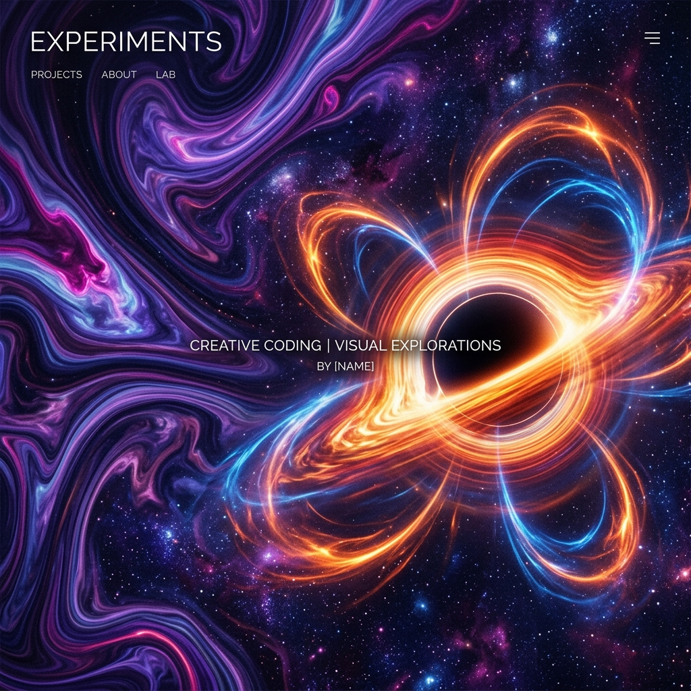

# Experiments — Vol. I
> A laboratory for creative physics, generative geometry, and computational aesthetics.

This repository serves as a research journal for exploring the intersection of mathematical rigor and visual art. Each experiment is a self-contained study in implementing complex physical phenomena or geometric systems within the browser.

---

## 🔬 Current Research (Volume I)

### [№ 01 — Flame Fractals](Flame/Flame3d_v003.html)
An implementation of Iterated Function Systems (IFS) based on Scott Draves' Fractal Flame algorithm.
- **Scope:** 2D and 3D density estimation rendering.
- **Key Features:** Nonlinear variations, logarithmic color mapping, and statistical super-sampling.

### [№ 02 — Gas Giant (S² FLIP)](Gas Giant/FLIPsphere_v001.html)
Fluid dynamics on a spherical manifold using a 6-face cubemap atlas.
- **Scope:** Planetary atmosphere visualization.
- **Key Features:** Geodesic advection, Jacobi pressure solve across cube seams (Helmholtz-Hodge decomposition), and no pole singularities.

### [№ 03 — Solar Corona (MHD)](Corona/Corona_v001.html)
A Magnetohydrodynamic (MHD) simulation of the Sun's atmosphere.
- **Scope:** Plasma dynamics and magnetic topology.
- **Key Features:** Magnetic loop force fields, procedural CME (Coronal Mass Ejection) events, and temperature-based color gradients.

### [№ 04 — Black Hole (Relativity)](Black Hole/Black Hole_v001.html)
Ray-traced visualization of a Schwarzschild black hole.
- **Scope:** General Relativity approximations in real-time.
- **Key Features:** Light bending (gravitational lensing), Doppler boosting, and accretion disk dynamics.
- **Bonus:** Included [WebGPU implementation](Black Hole/webgpu-black-hole/index.html) for high-performance compute-based ray-marching.

---

## 🗺️ Roadmap

### Volume II: Quantum & Chaos (Q3 2026)
- **№ 05 — Superfluid Vortices:** Ginzburg-Landau simulation of quantized vortices in Bose-Einstein condensates.
- **№ 06 — N-Body Galactica:** Barnes-Hut accelerated galaxy formation and dark matter dynamics.
- **№ 07 — Wave Collapse:** 3D Schrödinger Equation visualization with quantum tunneling.
- **№ 08 — Strange Attractors:** High-precision chaotic system integration (Aizawa/Thomas).

### Volume III: Morphogenesis (Q4 2026)
- **№ 09 — Turing Manifolds:** Reaction-Diffusion (Gray-Scott) implemented on arbitrary surface meshes.
- **№ 10 — Crystal Growth:** 3D Diffusion Limited Aggregation (DLA) for mineral-like fractal growth.

---

## 🛠️ Technology Stack
- **Core:** Vanilla JavaScript (ES6+), HTML5 Canvas.
- **Graphics:** WebGL2 (Primary), WebGPU (Experimental).
- **Math:** GLSL Shaders for parallelized physical integration.
- **Design:** Cormorant Garamond & JetBrains Mono for the "Scientific Journal" aesthetic.

---

## 📜 License

### Source Code
The **source code** in this repository is licensed under the [MIT License](LICENSE).

### Generated Art & Media
Any images, animations, or parameter sets generated using the code in this repository are licensed under the [Creative Commons Attribution-NonCommercial 4.0 International (CC BY-NC 4.0)](https://creativecommons.org/licenses/by-nc/4.0/) license. 

---
*Created with passion for the physics of light and motion.*
